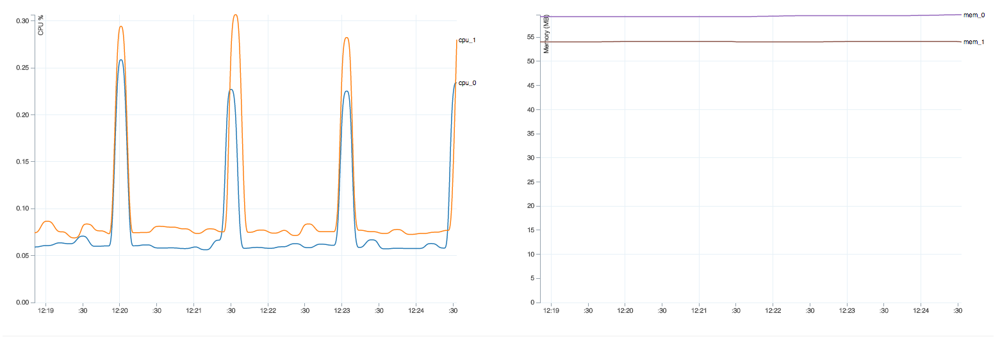

## CF CLI Live Stats Plug-in

This plug-in allows you to view live usage stats for an application in a browser.

### Install

```
$ go get github.com/danhigham/cf-live-stats
$ cf install-plugin $GOPATH/bin/cf-live-stats

OR

$ cf install-plugin -r CF-Community 'Live Stats'
```

### Usage

```
$ cf live-stats <app-name-goes-here>
HTTP server listening at http://localhost:8080

```

You can also pass in a different HTTP port after the application name to run the http
server on a port other than 8080

Connecting to the HTTP server, you should see something like this. All the times are in GMT, converting
to local time is on the todo list!

